# Install Visual Studio Code in Windows 11

Visual Studio Code is a popular code editor that is widely used by developers for various programming tasks. In this guide, we will walk you through the steps to download and install Visual Studio Code on a Windows 11 operating system.

## Prerequisites

Before you begin the installation process, make sure you have the following prerequisites:

- A Windows 11 operating system installed on your computer.
- An active internet connection to download the Visual Studio Code installer.
- Sufficient disk space to install the software
- Administrative privileges to install software on your system (as system) but not necessary (as user).

## Steps to Install Visual Studio Code on Windows 11

1. **Download the Visual Studio Code Installer**:

- Open your web browser and go to the official Visual Studio Code website at [https://code.visualstudio.com/](https://code.visualstudio.com/).
- Click on the "Download for Windows" button to download the installer.

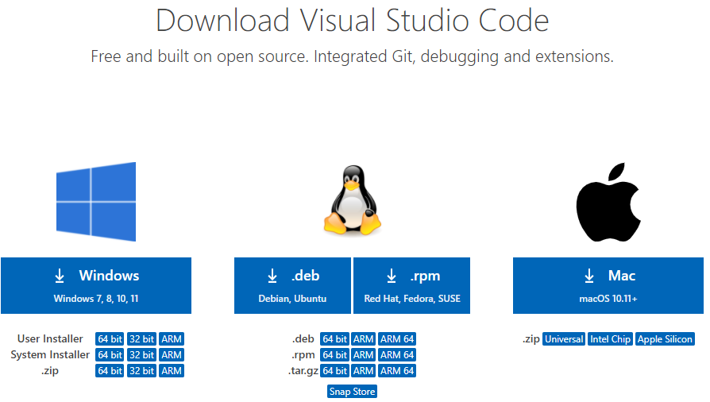

2. **Run the Installer**:

- Once the installer is downloaded, locate the downloaded file (usually in the Downloads folder) and double-click on it to run the installer.

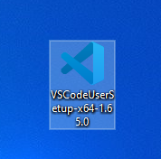

3. **Installation Wizard**:

- The installation wizard will guide you through the installation process. Click on the "Next" button to proceed.
- Read and accept the license agreement by checking the box and clicking on the "Next" button.

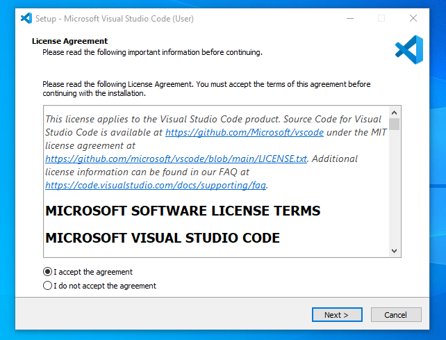

- Choose the destination folder where you want to install Visual Studio Code or leave the default location and click on the "Next" button.
- Select additional tasks like creating shortcuts and associating file types with Visual Studio Code and click on the "Next" button.

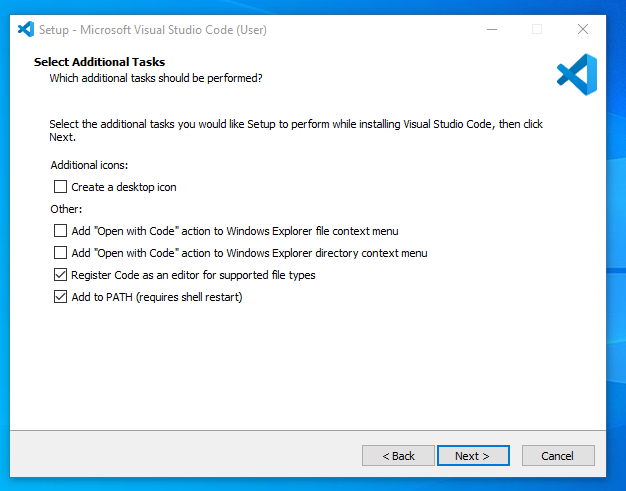

- Click on the "Install" button to start the installation process.

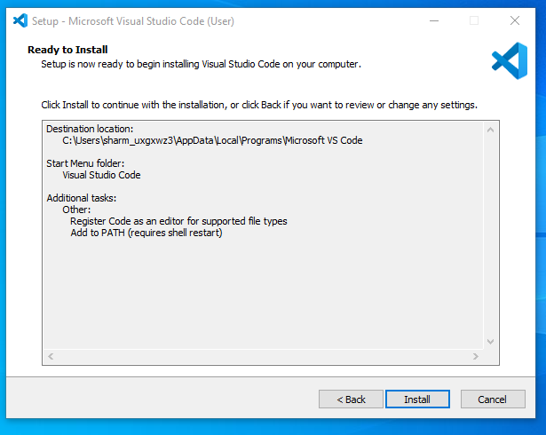

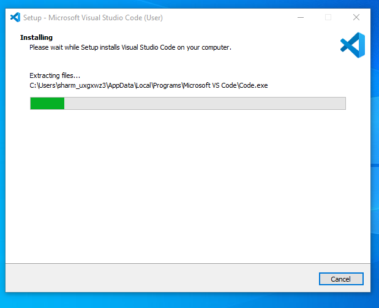

- Wait for the installation to complete. Once the installation is finished, click on the "Finish" button to exit the installer.

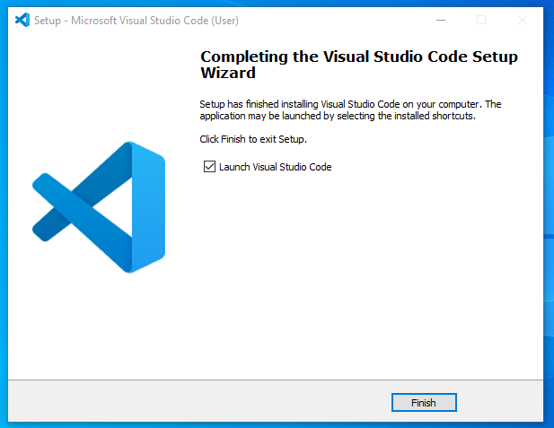

4. **Launch Visual Studio Code**:

- After the installation is complete, you can launch Visual Studio Code by double-clicking on the desktop shortcut or searching for it in the Start menu.
- Visual Studio Code is now installed on your Windows 11 operating system, and you can start using it for your coding projects.

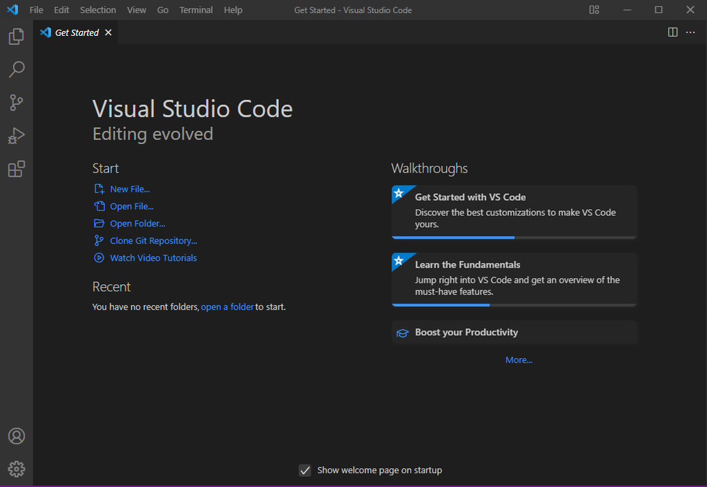

## First-time Setup

- After installing Visual Studio Code (VS Code), there are several initial configurations and settings that can be adjusted for an optimal coding environment:

- **Theme**: VS Code comes with several pre-installed themes that you can switch to. You can change the theme by going to File > Preferences > Color Theme. eg "Monokai" or "Dark+ (default dark)".

- **Font Size and Family**: You can adjust the editor's font size and family to suit your preference. This can be done by going to File > Preferences > Settings and searching for Editor: Font Size and Editor: Font Family.

- **Tab Size and Spaces**: You can set your preferred tab size and whether to use spaces or tabs for indentation. This can be done by going to File > Preferences > Settings and searching for Editor: Tab Size and Editor: Insert Spaces.

- **Word Wrap**: You can enable word wrap if you want long lines to wrap and not extend horizontally. This can be done by going to File > Preferences > Settings and searching for Editor: Word Wrap.

- **Extensions**: Extensions can greatly enhance your coding experience in VS Code. Some recommended extensions for general coding include: `Ctrl + Shift + X`

  - **Prettier**: An opinionated code formatter that supports many languages.
  - **ESLint**: A pluggable and configurable linter tool for identifying and reporting on patterns in JavaScript.
- Remember to reload VS Code after installing any extensions to ensure they are properly activated.

- The User Settings in VS Code can be accessed by going to File > Preferences > **Settings** or by pressing `Ctrl + ,`. Here, you can customize various settings to tailor the editor to your preferences.

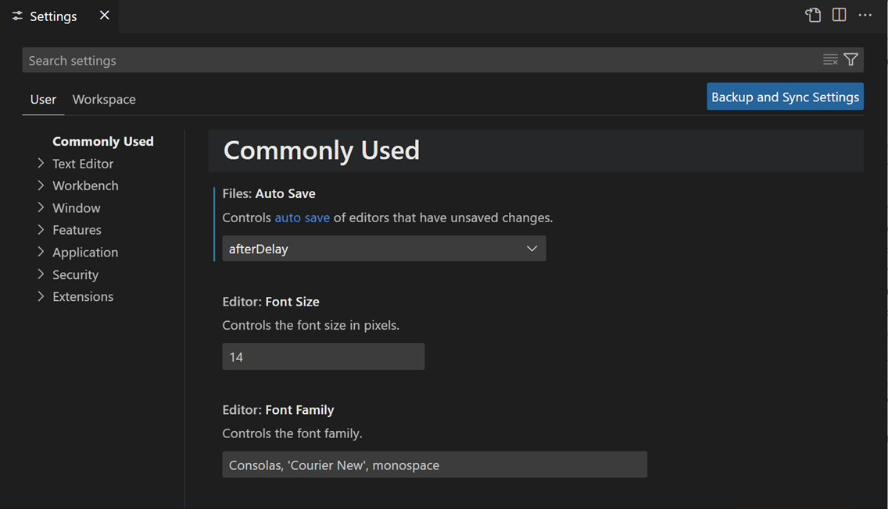
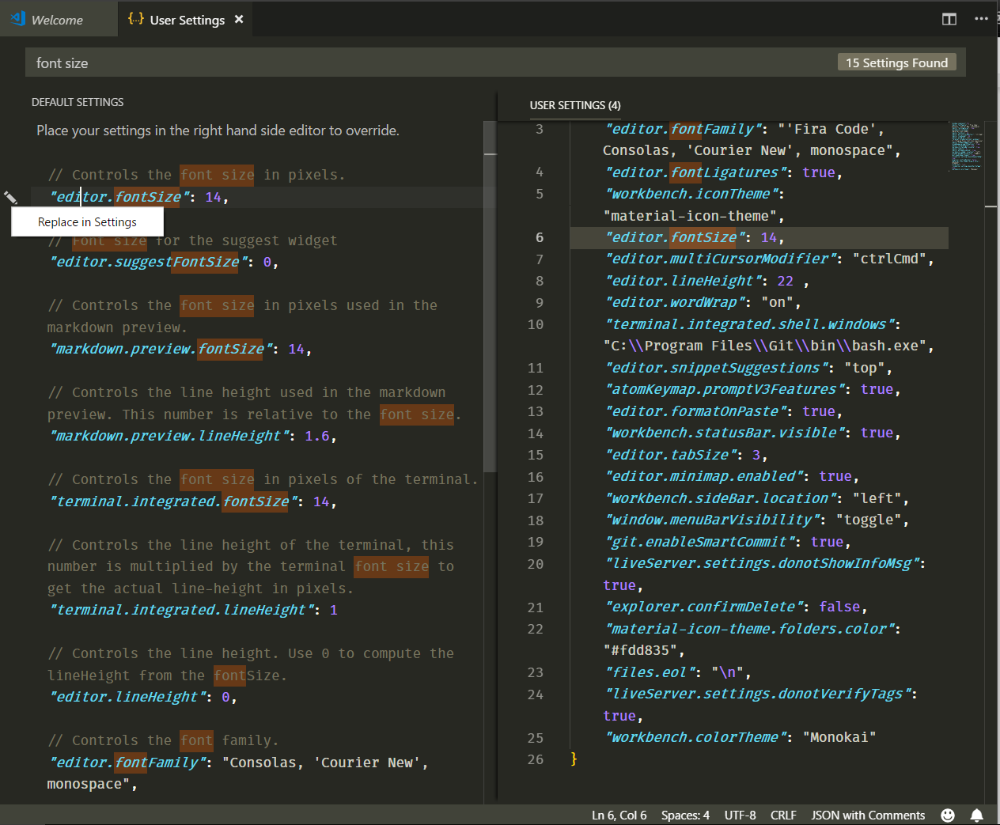

- Alternatively, you can use the Command Palette (`Ctrl + Shift + P`) to access and search for settings and configurations **"Preferences: Open Settings (JSON)"**

## User Interface Overview

- To install **extensions**, you can use the Extensions view (`Ctrl + Shift + X`) to search for and install extensions from the Visual Studio Code Marketplace.
- **Terminal**: The integrated terminal in VS Code allows you to run shell commands directly within the editor. You can open the terminal by going to View > Terminal or by pressing `Ctrl + '`'.

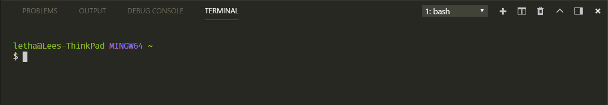

- **Souce Control:** VS Code has built-in Git support that allows you to manage your source code repositories directly within the editor. You can initialize a repository, make commits, and push changes to GitHub using the Source Control view. `Ctrl + Shift + G`

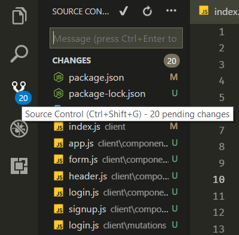

- **Opening and managing files and folders** in VS Code is straightforward. You can open files by clicking on them in the Explorer view or by using the File > Open File command (`Ctrl + O`). You can create new files by right-clicking in the Explorer view and selecting New File or by using the File > New File command (`Ctrl + N`).

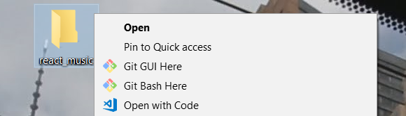

- **Minimap**: The minimap on the right side of the editor provides a preview of the entire file and allows you to quickly navigate to different sections of the code.

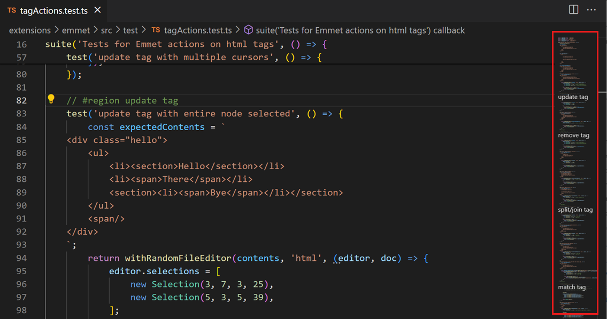

- **Breadcrumbs**: The breadcrumbs bar at the top of the editor shows the current file's path and allows you to navigate between different files and directories efficiently.

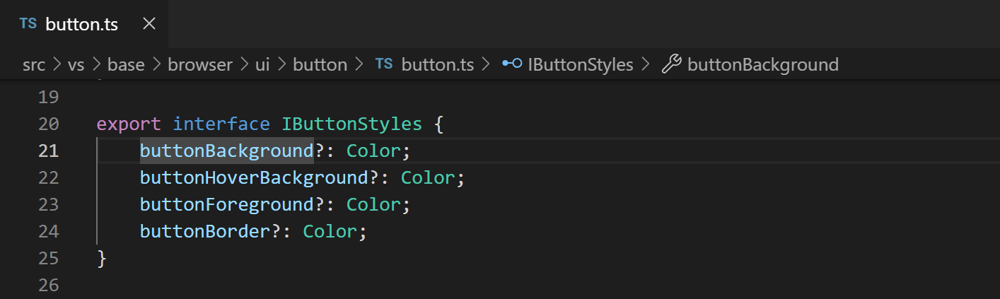

- **Tabs**: The tabs at the top of the editor allow you to switch between open files quickly. You can also use `Ctrl + Tab` to cycle through open files.

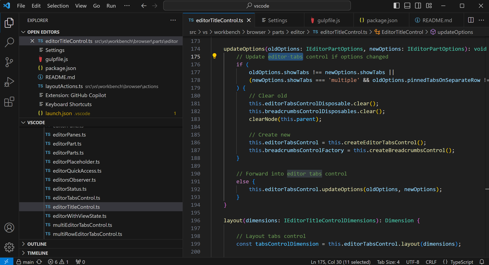

## Command Palette

- The Command Palette in VS Code is a powerful tool that allows you to access various commands and features quickly. You can open the Command Palette by pressing `Ctrl + Shift + P` or by going to View > Command Palette.

- Some common tasks that can be performed using the Command Palette include:

  - **Opening files**: You can open files by typing "File: Open File" in the Command Palette and entering the file path.
  - **Running tasks**: You can run tasks like building, testing, or debugging your code by typing the task name in the Command Palette.
  - **Changing settings**: You can access and change settings by searching for specific settings in the Command Palette.
  - **Installing extensions**: You can search for and install extensions from the Visual Studio Code Marketplace using the Command Palette.
  - **Running Git commands**: You can run Git commands like committing changes, pulling, or pushing code by typing the Git command in the Command Palette.
  - **Searching for commands**: If you're not sure which command to use, you can search for specific commands or features by typing keywords in the Command Palette.
- The Command Palette is a versatile tool that can help you perform various tasks quickly and efficiently without having to navigate through menus or remember specific keyboard shortcuts.

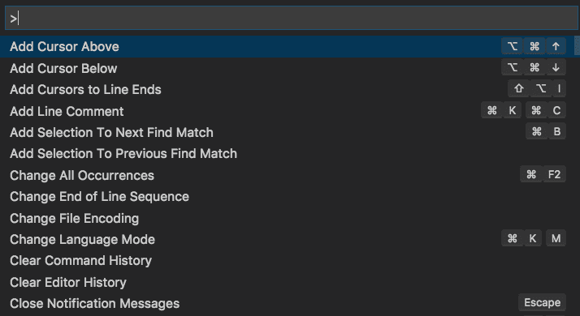

## Extensions in VS Code

- Extensions play a crucial role in enhancing the functionality of Visual Studio Code. They allow users to add new features, languages, themes, and tools to the editor, making it more powerful and customizable.
- Users can find, install, and manage extensions in VS Code through the Extensions view (`Ctrl + Shift + X`). Here, you can search for extensions by name or category, read reviews and ratings, and install them with a single click.

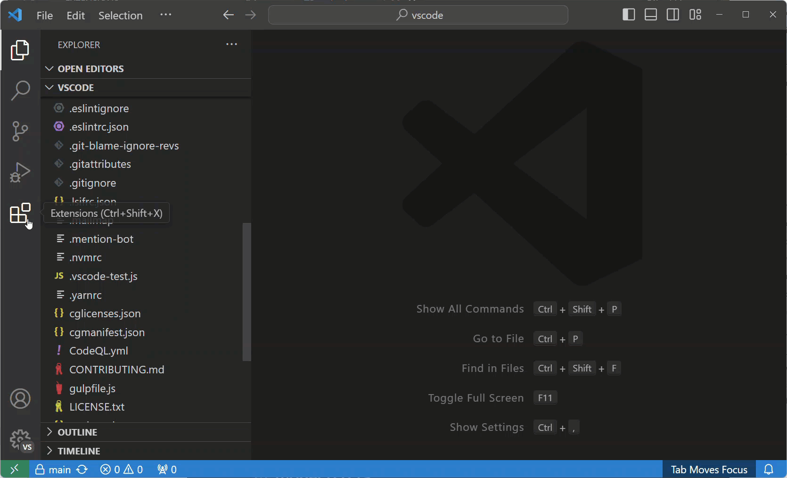

## Integrated Terminal

- The integrated terminal in VS Code allows you to run shell commands directly within the editor, eliminating the need to switch between the editor and an external terminal. You can open the terminal by going to View > Terminal or by pressing `Ctrl + '`.
- The integrated terminal provides several advantages over an external terminal, including:

  - **Seamless integration**: The terminal is fully integrated into the editor, allowing you to run commands and view output without leaving the editor.
  - **Customization**: You can customize the terminal's appearance, font, and color scheme to suit your preferences.
  - **Multi-line input**: The terminal supports multi-line input, allowing you to run complex commands or scripts more efficiently.
  - **Split view**: You can split the editor view to display the terminal alongside your code, making it easier to work with both simultaneously

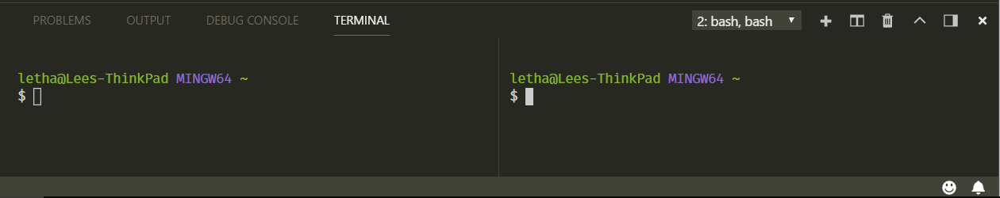

## File and Folder Management

- In VS Code, you can create, open, and manage files and folders using the Explorer view (`Ctrl + Shift + E`). Here are some common file and folder management tasks:

  - **Creating files**: You can create new files by right-clicking in the Explorer view and selecting New File or by using the File > New File command (`Ctrl + N`).
  - **Opening files**: You can open files by clicking on them in the Explorer view or by using the File > Open File command (`Ctrl + O`).
  - **Creating folders**: You can create new folders by right-clicking in the Explorer view and selecting New Folder or by using the File > New Folder command.
  - **Renaming files and folders**: You can rename files and folders by right-clicking on them in the Explorer view and selecting Rename or by pressing `F2`.
  - **Deleting files and folders**: You can delete files and folders by right-clicking on them in the Explorer view and selecting Delete or by pressing `Delete`.

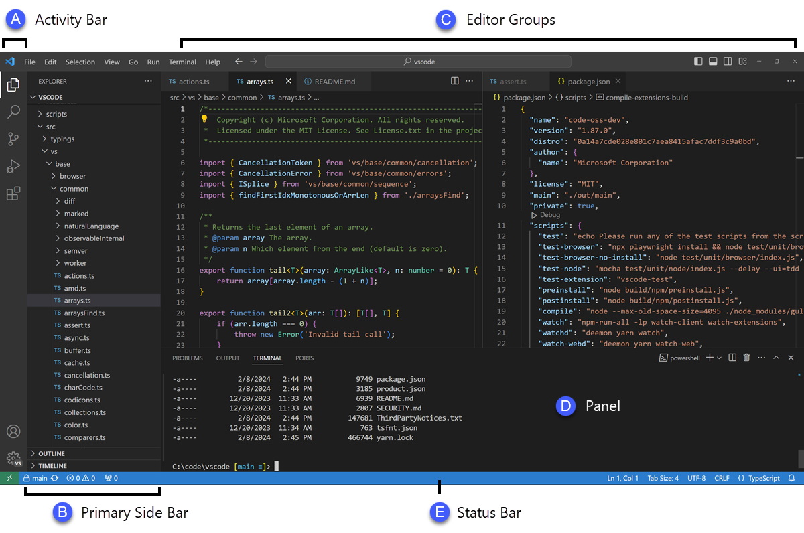

- To navigate between different files and directories efficiently, you can use the breadcrumbs bar at the top of the editor, the tabs at the top of the editor, and the minimap on the right side of the editor.

## Settings and Preferences

- Users can find and customize settings in VS Code by going to File > Preferences > Settings or by pressing `Ctrl + ,`. Here, you can search for specific settings, customize keybindings, change the theme, font size, and more.

## Debugging in VS Code

- To set up and start debugging a simple program in VS Code, follow these steps:

 1. **Open a project folder**: Open a project folder in VS Code that contains the code you want to debug.
 2. **Create a launch configuration**: Click on the Debug icon in the Activity Bar on the side of the editor and then click on the gear icon to create a launch.json file.
 3. **Select a debug configuration**: Choose the appropriate debug configuration for your project (e.g., Node.js, Python, etc.).
 4. **Set breakpoints**: Click in the gutter next to the line numbers to set breakpoints in your code.
 5. **Start debugging**: Click on the green play button in the Debug view to start debugging your code.
 6. **Use debugging features**: You can use features like stepping through code, inspecting variables, and watching expressions to debug your code effectively.
 7. **View output**: You can view the output of your code and debug messages in the Debug Console.
 8. **Stop debugging**: Click on the red square button in the Debug view to stop debugging your code.

- Some key debugging features available in VS Code include:
- **Breakpoints**: You can set breakpoints in your code to pause execution at specific points and inspect the program's state.
- **Watch**: You can watch variables and expressions to monitor their values as you step through the code.
- **Call Stack**: You can view the call stack to see the sequence of function calls that led to the current point in the code.
- **Debug Console**: You can use the Debug Console to interactively run code and evaluate expressions during debugging.
- **Step Through Code**: You can step through your code line by line to understand how it executes and identify issues.

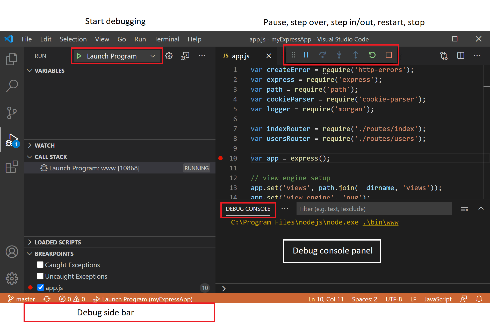

## Using Source Control

- To integrate Git with VS Code for version control, follow these steps:

 1. **Initialize a repository**: Open a project folder in VS Code and click on the Source Control icon in the Activity Bar to initialize a Git repository.
 2. **Stage changes**: Stage changes by clicking on the "+" button next to the files you want to commit.
 3. **Commit changes**: Enter a commit message in the message box at the top of the Source Control view and click on the checkmark icon to commit your changes.
 4. **Push changes to GitHub**: If you want to push your changes to a remote repository on GitHub, click on the ellipsis (...) next to the commit message and select Push.

- By following these steps, you can effectively manage your source code repositories using Git within VS Code.
- The Source Control view (`Ctrl + Shift + G`) provides a visual interface for managing your Git repositories, making it easy to track changes, commit code, and collaborate with others.

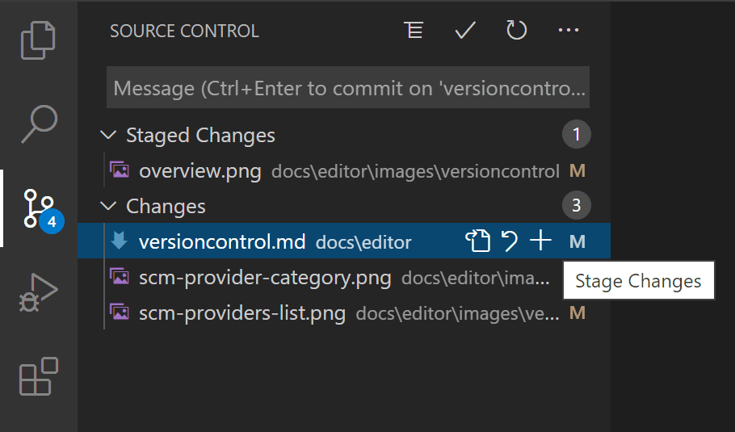

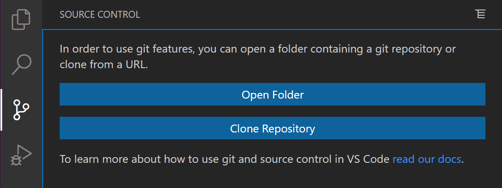

## Sources

- [Visual Studio Code - Download](https://code.visualstudio.com/download)
- [Visual Studio Code - Documentation](https://code.visualstudio.com/docs)
- [Windows 11 - Official Website](https://www.microsoft.com/en-us/windows/windows-11)
- [Geeks For Geeks](https://www.geeksforgeeks.org/how-to-install-visual-studio-code-on-windows/)
- [An overview of Visual Studio Code](https://www.freecodecamp.org/news/an-overview-of-visual-studio-code-for-front-end-developers-49a4aa0771fb/)
- [VS Code Docs](https://code.visualstudio.com/docs)
